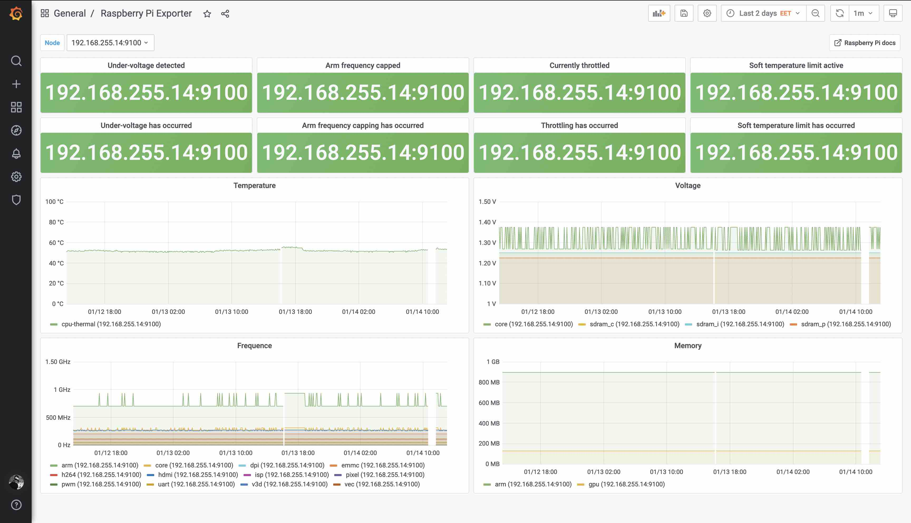
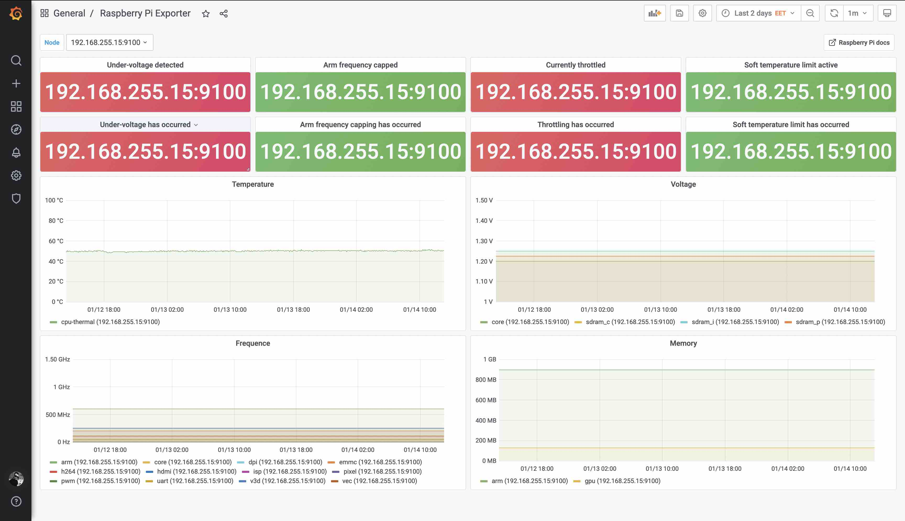

# Prometheus Raspberry Pi Exporter

Export Raspberry Pi metrics in Prometheus node_exporter's textfile format.

To visualizate it you can use preconfigured [Grafana dashboard](./grafana_dashboard.json).





Also you can find simple [Alert rules for Prometheus](./alert_rules.yml) in this repo.

## Install

```bash
curl -o /usr/local/bin/rpi_exporter https://raw.githubusercontent.com/urpylka/prometheus-raspberry-exporter/master/rpi_exporter
curl -o /etc/systemd/system/rpi_exporter.service https://raw.githubusercontent.com/urpylka/prometheus-raspberry-exporter/master/rpi_exporter.service
chmod +x /usr/local/bin/rpi_exporter
sudo systemctl enable rpi_exporter
sudo systemctl start rpi_exporter
```

To run `node-exporter` use:

```bash
docker run -d -p 9100:9100 --pid="host" --name=node_exporter -v "/:/host:ro,rslave" --restart=unless-stopped prom/node-exporter --path.rootfs=/host --collector.textfile.directory=/host/var/lib/node_exporter/textfile_collector
```

To uninstall use:

```bash
sudo systemctl stop rpi_exporter
sudo systemctl disable rpi_exporter
sudo rm /etc/systemd/system/rpi_exporter.service
sudo rm /usr/local/bin/rpi_exporter
```

## Configure your node exporter

1. Make sure your node exporter uses `textfile` in `--collectors.enabled`
2. Add the following parameter `--collector.textfile.directory=/var/lib/node_exporter`

## Example queries

```prom
rpi_temperature{chip="cpu-thermal",sensor="thermal_zone0"} 53.692
rpi_freq{device="arm"} 700000000
rpi_freq{device="core"} 268750000
rpi_freq{device="h264"} 0
rpi_freq{device="isp"} 0
rpi_freq{device="v3d"} 270834000
rpi_freq{device="uart"} 47999000
rpi_freq{device="pwm"} 0
rpi_freq{device="emmc"} 200000000
rpi_freq{device="pixel"} 338000
rpi_freq{device="vec"} 108000000
rpi_freq{device="hdmi"} 0
rpi_freq{device="dpi"} 0
rpi_volt{device="core"} 1.2688
rpi_volt{device="sdram_c"} 1.2500
rpi_volt{device="sdram_i"} 1.2500
rpi_volt{device="sdram_p"} 1.2250
rpi_mem{device="arm"} 896
rpi_mem{device="gpu"} 128
rpi_throttled{bit="0"} 0
rpi_throttled{bit="1"} 0
rpi_throttled{bit="2"} 0
rpi_throttled{bit="3"} 0
rpi_throttled{bit="4"} 0
rpi_throttled{bit="5"} 0
rpi_throttled{bit="6"} 0
rpi_throttled{bit="7"} 0
rpi_throttled{bit="8"} 0
rpi_throttled{bit="9"} 0
rpi_throttled{bit="10"} 0
rpi_throttled{bit="11"} 0
rpi_throttled{bit="12"} 0
rpi_throttled{bit="13"} 0
rpi_throttled{bit="14"} 0
rpi_throttled{bit="15"} 0
rpi_throttled{bit="16"} 0
rpi_throttled{bit="17"} 0
rpi_throttled{bit="18"} 0
rpi_throttled{bit="19"} 0
```
